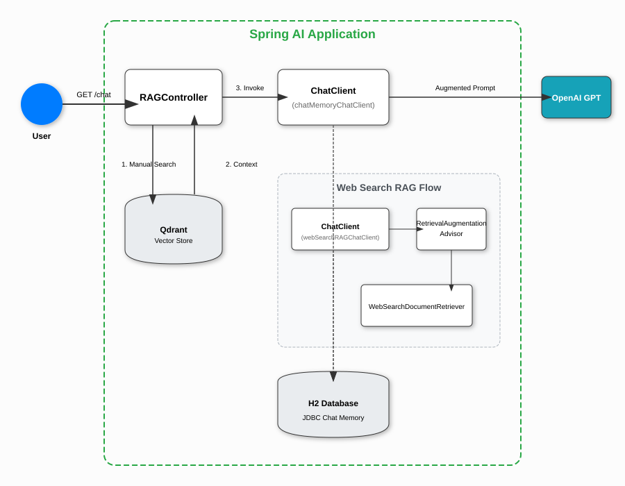

# Spring AI RAG Application



This repository demonstrates a **Retrieval-Augmented Generation (RAG)** implementation using **Spring AI**, **OpenAI**, and **Qdrant**. It supports both local vector store retrieval and real-time web search retrieval.


### Key Components:
1.  **RAGController**: Exposes REST endpoints for chatting. It manages manual vector search and invokes the appropriate `ChatClient`.
2.  **ChatClient**: Two instances are configured:
    - `chatMemoryChatClient`: Used by the `/random/chat` endpoint, it maintains conversation history.
    - `webSearchRAGChatClient`: Configured with a `RetrievalAugmentationAdvisor` for real-time web search.
3.  **RetrievalAugmentationAdvisor**: (Used in Web RAG) Orchestrates the retrieval of relevant context and augments the user prompt before sending it to the LLM.
4.  **Qdrant Vector Store**: Stores pre-loaded embeddings of local data. Searched manually by the `RAGController`.
5.  **WebSearchDocumentRetriever**: A custom retriever that uses the **Tavily API** to fetch real-time information from the web.
6.  **JDBC Chat Memory**: Uses an H2 database to persist conversation history across requests, shared by both clients.
7.  **TokenUsageAuditAdvisor**: Logs token usage for monitoring and cost management.

## 🚀 Getting Started

### Prerequisites
- Java 25+
- Docker (for Qdrant)
- OpenAI API Key
- Tavily API Key (optional, for web search)

### Configuration
Set the following environment variables:
```bash
export OPENAI_API_KEY='your-key'
export TAVILY_SEARCH_API_KEY='your-key' # Optional
```

### Running the Application
1. Start the infrastructure (Qdrant) via Docker Compose:
   ```bash
   docker compose up -d
   ```
2. Run the Spring Boot application:
   ```bash
   ./mvnw spring-boot:run
   ```

## 🧪 Testing the API

You can test the API using Postman or `curl`.

**Endpoint**: `GET http://localhost:8080/api/rag/random/chat`

**Parameters**:
- `message`: Your question (e.g., "What is Redis?")
- `username` (Header): A unique ID to identify the conversation session (e.g., `Naveenk`).

**Example Curl**:
```bash
curl -X GET "http://localhost:8080/api/rag/random/chat?message=what%20is%20redis?" \
     -H "username: Naveenk"
```

---
*Note: The application is configured to run on port 8080 by default. If you encounter port conflicts, check the logs and ensure no other process is using it.*