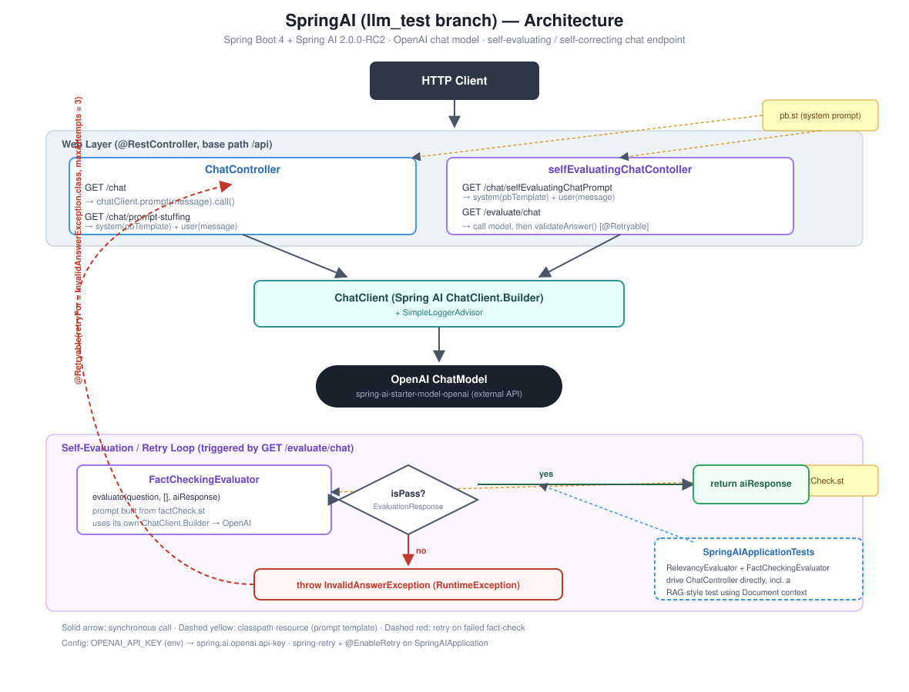

# SpringAI

A small Spring Boot playground for [Spring AI](https://spring.io/projects/spring-ai) 2.0.0-RC2, backed by
OpenAI's chat model. This branch (`llm_test`) focuses on a **self-evaluating chat endpoint**: a response is
generated, then automatically fact-checked, and re-tried if the check fails.

## Architecture



## Stack

- Java 25, Spring Boot 4.1.0
- `spring-ai-starter-model-openai` (`spring-ai-bom` 2.0.0-RC2)
- `spring-retry` (+ `spring-aspects`, `@EnableRetry`) for the self-correction retry loop
- JUnit 5 / AssertJ, exercising the model live via `RelevancyEvaluator` and `FactCheckingEvaluator`

## Endpoints

All endpoints are under `/api` and take a `message` query parameter unless noted.

| Method | Path | Controller | Description |
|---|---|---|---|
| GET | `/api/chat` | `ChatController` | Plain prompt, no system context. |
| GET | `/api/chat/prompt-stuffing` | `ChatController` | Prompt-stuffs the model with a system prompt loaded from `pb.st` (a pickleball fact sheet) before answering. |
| GET | `/api/chat/selfEvaluatingChatPrompt` | `selfEvaluatingChatContoller` | Same prompt-stuffing pattern as above. |
| GET | `/api/evaluate/chat` | `selfEvaluatingChatContoller` | Generates a response, then runs it through `FactCheckingEvaluator`; retries the whole call up to 3 times if the check fails. |

## Self-evaluation / retry flow

1. `selfEvaluatingChatContoller#chat` sends the user's message to the model.
2. The response is checked with `FactCheckingEvaluator`, which itself prompts the model using the template
   in `src/main/resources/promptTemplates/factCheck.st`.
3. If `EvaluationResponse.isPass()` is `false`, `InvalidAnswerException` (an unchecked `RuntimeException`) is
   thrown.
4. `@Retryable(retryFor = InvalidAnswerException.class, maxAttempts = 3)` re-invokes the whole method, so the
   model gets up to 3 attempts to produce a fact-checked answer before the exception propagates to the caller.

`@EnableRetry` is set on `SpringAIApplication` to activate Spring Retry's AOP proxying for this.

## Prompt templates

Located under `src/main/resources/promptTemplates/`:

- `pb.st` — system prompt / context used for prompt-stuffing endpoints.
- `factCheck.st` — instructs the evaluator model how to judge a claim against a document (or general
  knowledge when no document is supplied).

## Configuration

Set your OpenAI key as an environment variable before running:

```bash
export OPENAI_API_KEY=sk-...
```

`src/main/resources/application.properties` maps it to `spring.ai.openai.api-key`.
`src/test/resources/application.properties` provides its own copy of these properties (test resources take
precedence over `src/main/resources` on the test classpath) plus `test.relevancy.min-score` (default `0.7`),
the minimum score `RelevancyEvaluator`-based tests require to pass.

## Running

```bash
./mvnw spring-boot:run
```

## Testing

```bash
./mvnw test
```

`SpringAIApplicationTests` makes live calls to the configured OpenAI model — a valid `OPENAI_API_KEY` is
required to run it. It covers:

- Response relevancy (`RelevancyEvaluator`) for a basic question through `ChatController`.
- Factual accuracy (`FactCheckingEvaluator`) with no supporting document.
- Factual accuracy in a RAG-style scenario, where the pickleball prompt template is supplied as a
  `Document` for context.
