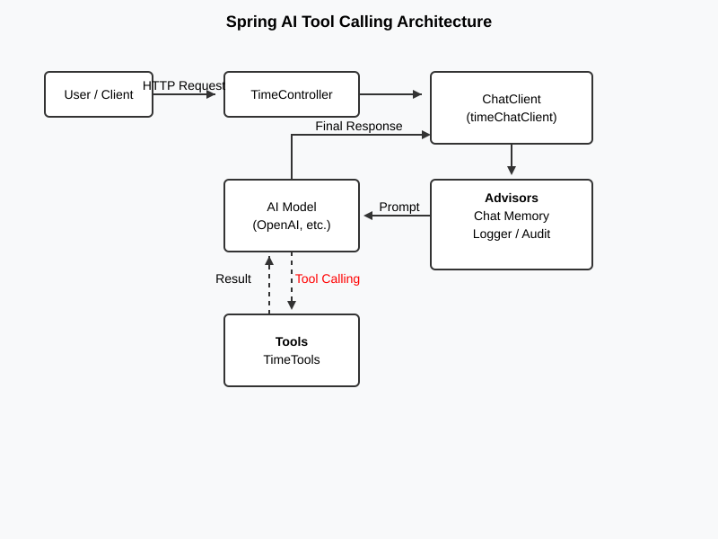

# Spring AI Project - Tool Calling

This project demonstrates how to use **Spring AI** to build intelligent applications that can interact with external tools and maintain conversation history.

## What is Tool Calling?

Imagine you are chatting with a smart personal assistant. If you ask it, "What time is it in London?", a regular AI might try to guess or use its training data (which might be outdated). 

With **Tool Calling**, the assistant has a "toolbox" it can use. When you ask about the time, the AI realizes it doesn't know the exact current time but sees a "Clock Tool" in its toolbox. It "calls" that tool, gets the real-time answer, and then tells you: "It is currently 5:00 PM in London."

In this project:
- The **AI Model** (like OpenAI) is the brain.
- The **Tools** (in `TimeTools.java`) are the specialized skills provided to the AI.
- The **ChatClient** acts as the manager that coordinates between you, the AI, and the tools.

## Architecture Overview

The system follows a structured flow to handle user requests:

1.  **User Request**: You send a message via a web endpoint (e.g., `/api/tools/local-time`).
2.  **Controller**: The `TimeController` receives your request and passes it to the `ChatClient`.
3.  **Advisors**: Before reaching the AI, "Advisors" kick in. They might look up your previous messages from a database (Chat Memory) or log the activity.
4.  **AI Model**: The AI analyzes your prompt. If it needs a specific piece of information (like the current time), it identifies which tool to use.
5.  **Tool Execution**: The system automatically runs the Java code in `TimeTools` and gives the result back to the AI.
6.  **Final Response**: The AI combines the tool's result into a friendly message and sends it back to you.

### Visual Architecture

You can find the detailed architecture diagram here:
`docs/tool-calling-architecture.svg`

## Key Components

- **TimeTools**: Contains Java methods annotated with `@Tool`, making them discoverable by the AI.
- **TimeChatClientConfig**: Configures the `ChatClient` with default tools and advisors (Memory, Logging).
- **H2 Database**: Used for storing chat history locally.

## Getting Started

1.  Ensure you have an OpenAI API key set in your environment variables.
2.  Run the application using `./mvnw spring-boot:run`.
3.  Access the H2 console at `http://localhost:8080/h2-console` to see your chat history.
